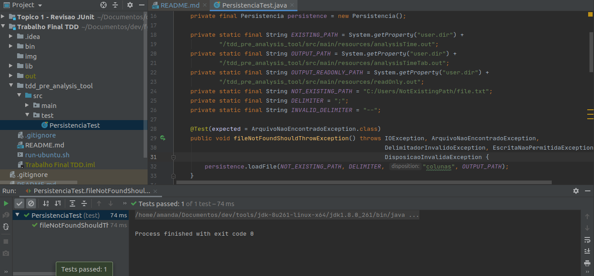
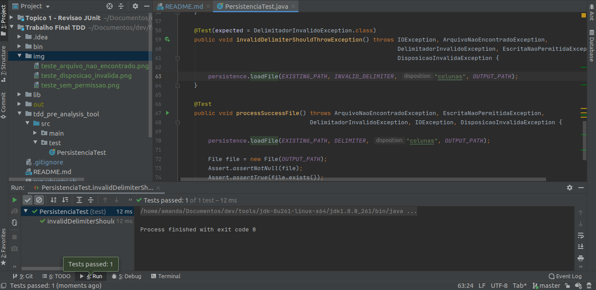
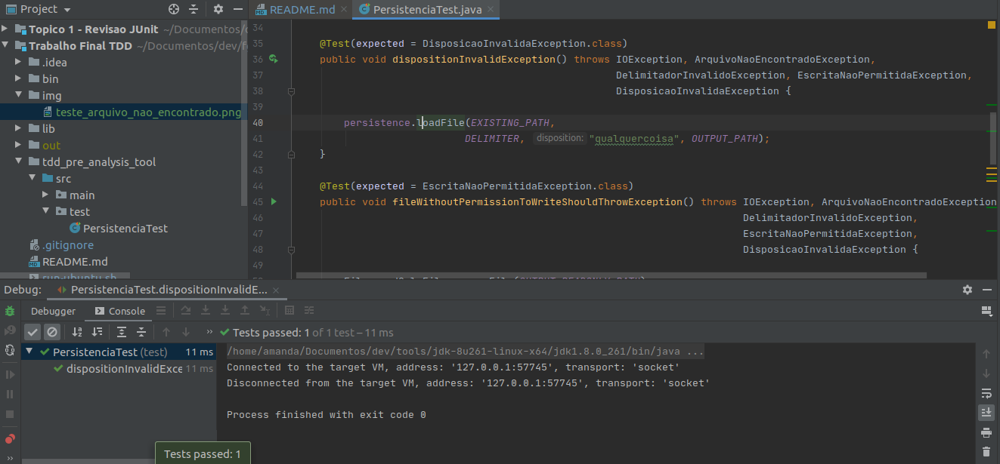
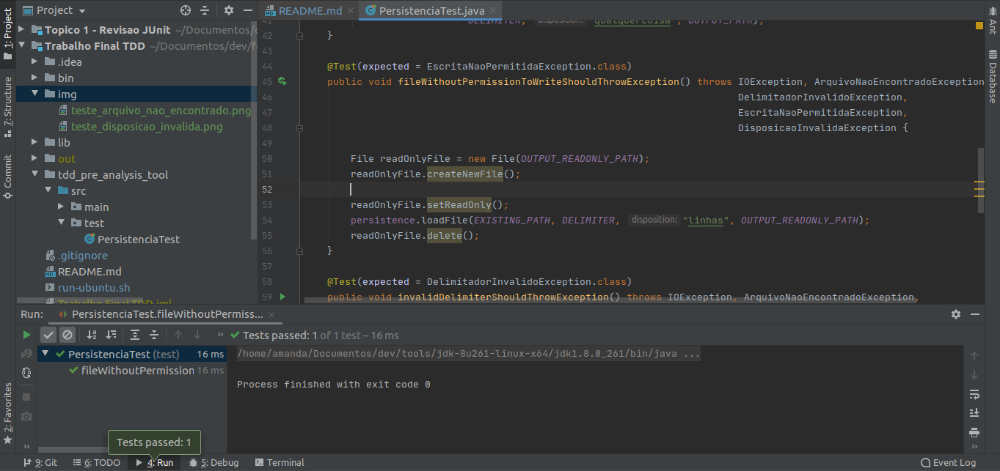

# Trabalho TDD

## Membros:
	* Amanda Vieira Pires      (15/0004796) 
	* Filipe Dias Soares Lima  (16/0006163)
	* Gustavo Barbosa Carvalho (16/0007780)


Execução do Trabalho:
```
* Entre na pasta raiz do projeto
   * Usando Ubuntu, rode: ./run-ubuntu
```

Caso obtenha o seguinte resultado:

```
bash: ./run-ubuntu.sh: Permissão negada
```

Execute:

```
chmod +x run-ubuntu.sh
```

Mesmo após ter refatorado o código, os testes continuaram passando.

Seguem evidências:

* Teste de arquivo não encontrado:

<p align="center">
  
</p>

* Teste delimitador inválido:

<p align="center">
  
</p>

* Teste disposição inválida:

<p align="center">
  
</p>

* Teste arquivo sem permissão de escrita:

<p align="center">
  
</p>

* Teste processamento realizado com sucesso:

<p align="center">
  
</p>